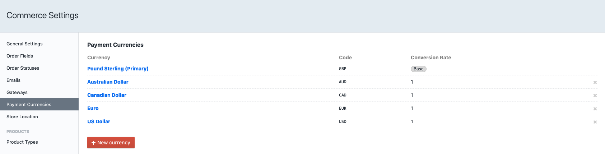
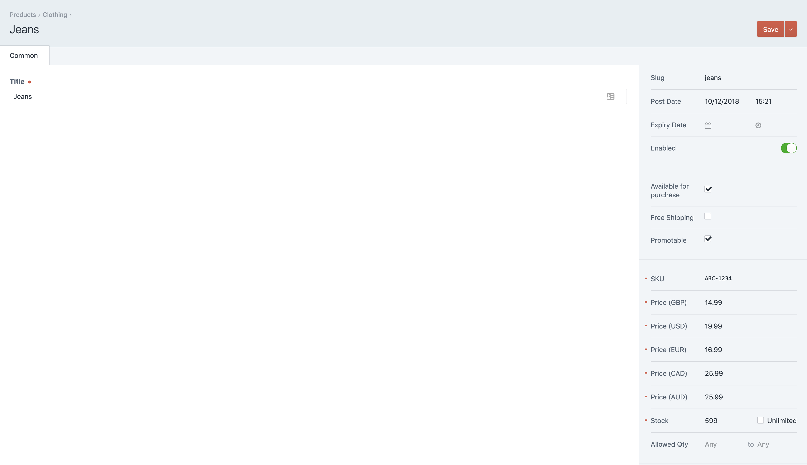
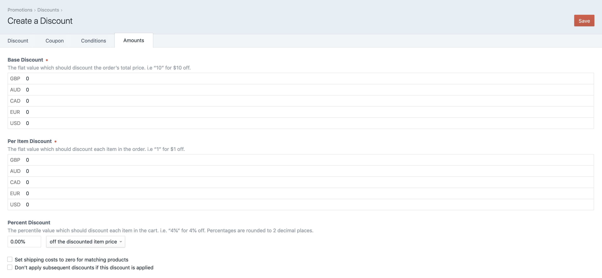
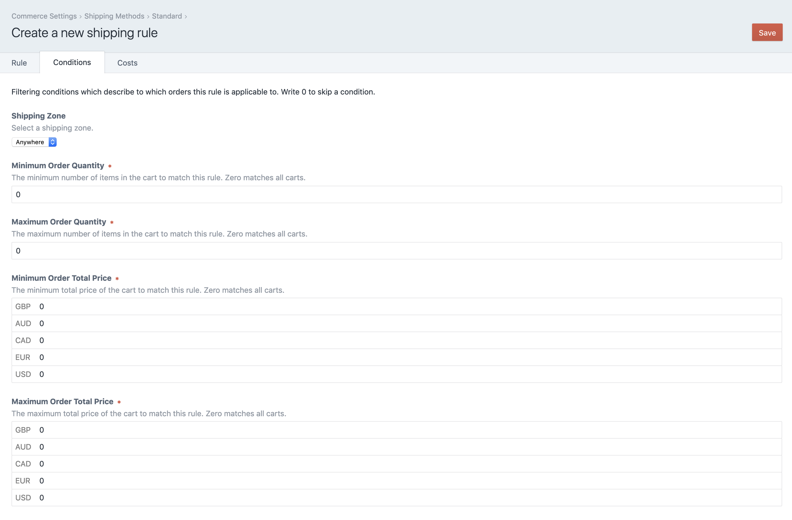
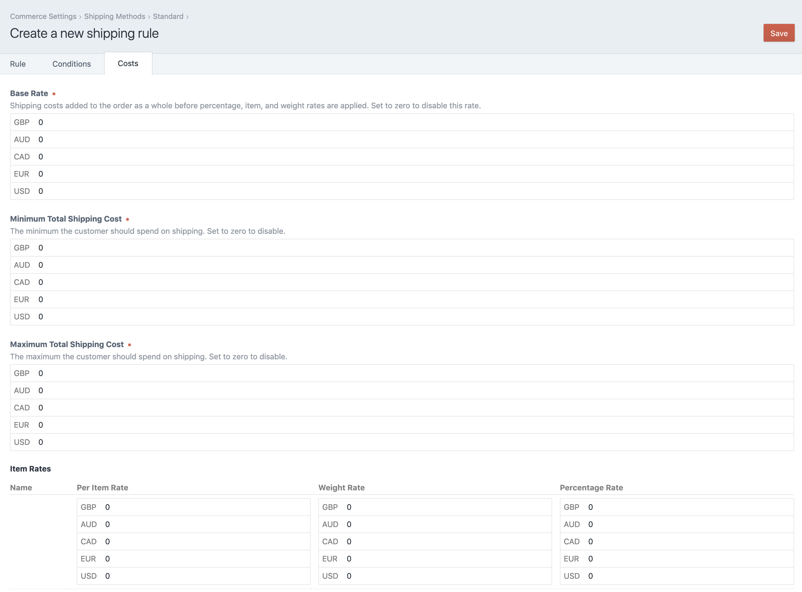

# Currency Prices plugin for Craft CMS 3.x

Adds the option to set product prices in different currencies

## Requirements

This plugin requires Craft CMS 3.0.0-beta.23 or later.

## Installation

To install the plugin, follow these instructions.

1. Open your terminal and go to your Craft project:

        cd /path/to/project

2. Then tell Composer to load the plugin:

        composer require webdna/commerce-currency-prices

3. In the Control Panel, go to Settings → Plugins and click the “Install” button for Currency Prices.

## Currency Prices Overview

Configure your payment currencies in Craft Commerce settings - foreach currency set the conversion rate to 1.



Additional currency price fields will be added to Products, Discounts and Shipping Rules.

**Products**

Products will now display a price field for each currency setup.

The product price used in the cart will change depending on which payment currency is selected.



To display a product currency price use one of the the following Twig filter:

```twig
{{ product.defaultVariant|currencyPrice('GBP') }}

{{ product.defaultVariant|currencySalePrice('GBP') }}
```

The current cart payment currency could be used to set the currency in the Twig filter:

```twig
{{ product.defaultVariant|currencyPrice(cart.paymentCurrency) }}

{{ product.defaultVariant|currencySalePrice(cart.paymentCurrency) }}
```

**Discounts**

Add product discounts for each of your currencies



**Shipping**

Setup shipping conditions and costs for each of your payment currencies.

_Shipping Conditions_



_Shipping Costs_




**Currency Fieldtype**

Adds a 'Currencies' fieldtype giving a dropdown list of payment currencies

Brought to you by [webdna](https://webdna.co.uk/)
